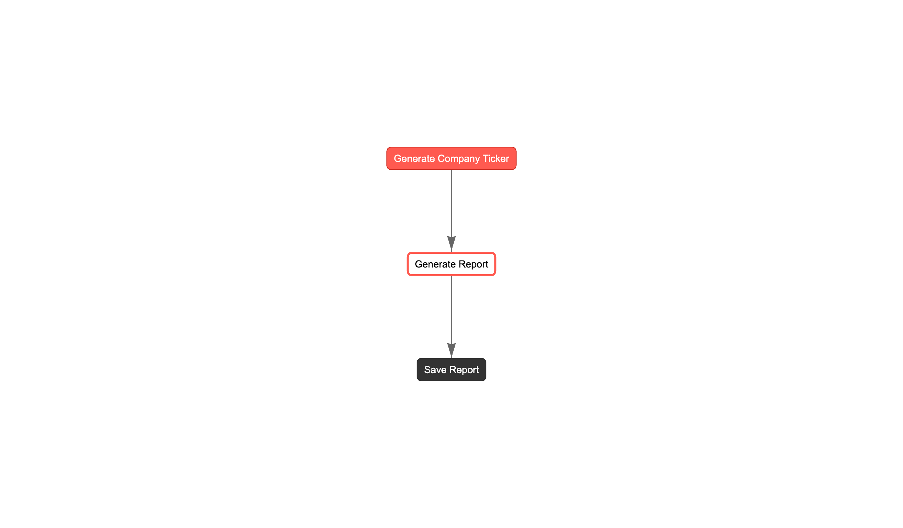

# Stock Analysis with CrewAI
> Intelligent stock analysis using agent RAG (Retrieval Augmented Generation) architecture powered by CrewAI, Ollama, yfinance and OpenLit.

## Quick Start Guide

Requirements:
- Docker
- Python >= 3.10 <= 3.13
- pyenv

### 1. Install Dependencies


#### Clone and setup OpenLit

```bash
git clone git@github.com:openlit/openlit.git
```

#### Run OpenLit

```bash
cd openlit && docker compose up -d && cd ..
```


#### Setup Ollama

```bash
docker run -d -v ollama:/root/.ollama -p 11434:11434 --name ollama ollama/ollama
```


```bash
docker exec -it ollama ollama run gemma:2b
```

```bash
docker exec -it ollama ollama pull nomic-embed-text
```

### 2. Install required Python packages

```bash
cd stock_analysis && uv pip install -r pyproject.toml && cd ..
```

### 3. Run the Stock Analysis Crew

```bash
crewai flow kickoff
```

Open the `report.md` file to see the results.

#### Access the OpenLit dashboard at http://localhost:3000/

**Default credentials:**
- Email: user@openlit.io
- Password: openlituser


### 4. Plot the Flow

```bash
crewai flow plot
```

### 5. View the Flow Plot

Open the `crewai_flow.html` file in your web browser to see an interactive visualization of the crew's workflow. The flow plot shows:

- Agents and their roles
- Task dependencies and execution order
- Information flow between components




